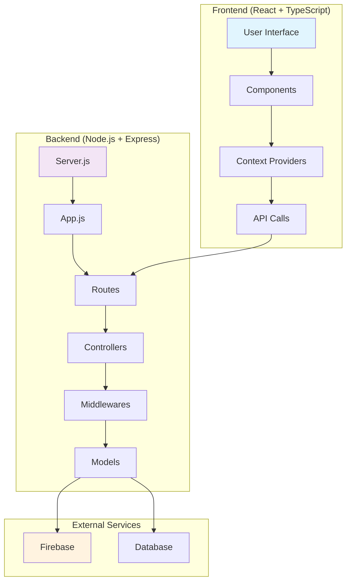
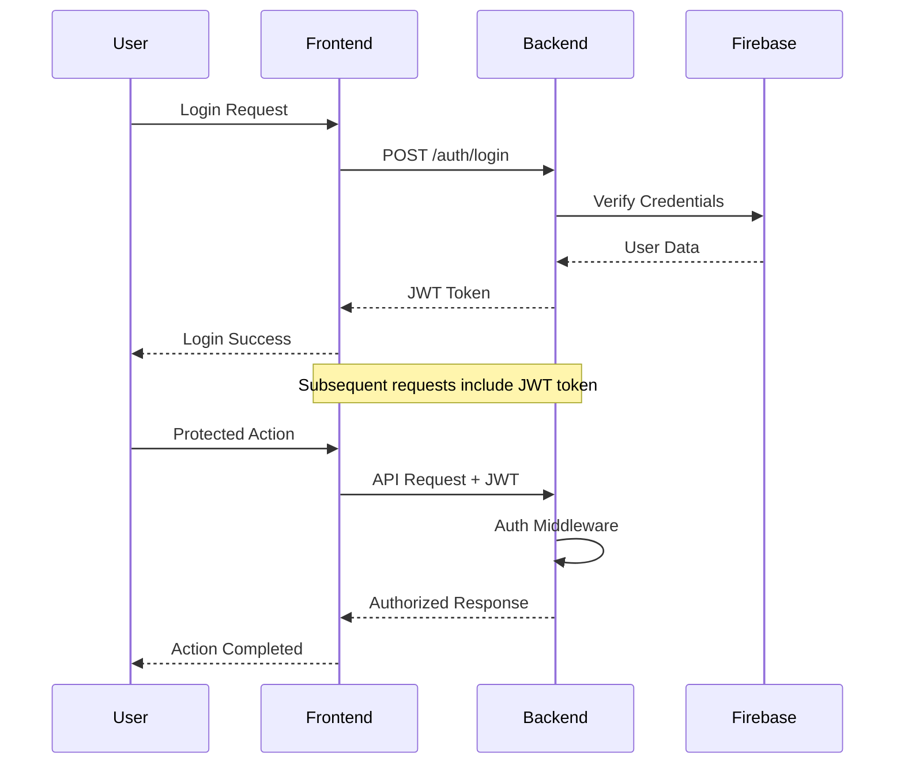

# MedicalQ Project Structure

## 📁 Project Overview

```
MedicalQ/
├── 📂 Backend/                 # Node.js/Express API Server
│   ├── 📂 Config/             # Configuration files
│   │   └── 📄 Firebase.js     # Firebase configuration
│   ├── 📂 Controllers/        # Business logic handlers
│   │   └── 📄 authController.js
│   ├── 📂 Middlewares/        # Custom middleware functions
│   │   ├── 📄 Auth.js         # Authentication middleware
│   │   ├── 📄 Error.js        # Error handling middleware
│   │   └── 📄 adminMiddleware.js
│   ├── 📂 Models/             # Data models & schemas
│   │   └── 📄 User.js         # User model
│   ├── 📂 Routes/             # API route definitions
│   │   └── 📄 authRoutes.js   # Authentication routes
│   ├── 📂 src/                # Source utilities
│   │   ├── 📂 components/     # Backend components
│   │   │   ├── 📂 auth/       # Authentication components
│   │   │   │   └── 📄 AuthModel.tsx
│   │   │   ├── 📂 dashboard/  # Dashboard components
│   │   │   │   └── 📄 UserDashboard.tsx
│   │   │   └── 📂 home/       # Home page components
│   │   │       ├── 📄 Features.tsx
│   │   │       ├── 📄 Hero.tsx
│   │   │       └── 📄 Stats.tsx
│   │   ├── 📂 layout/         # Layout components
│   │   │   └── 📄 Header.tsx
│   │   ├── 📂 contexts/       # Context providers
│   │   │   └── 📄 AuthContext.tsx
│   │   ├── 📄 App.tsx
│   │   ├── 📄 index.css       # Global styles
│   │   ├── 📄 main.tsx        # Main entry point
│   │   └── 📄 vite-env.d.ts   # Vite environment types
│   ├── 📂 utils/              # Utility functions
│   │   └── 📄 logger.js       # Logging utilities
│   ├── 📄 .gitignore          # Git ignore rules
│   ├── 📄 LICENSE             # License file
│   ├── 📄 README.md           # Backend documentation
│   ├── 📄 app.js              # Express app configuration
│   ├── 📄 eslint.config.js    # ESLint configuration
│   ├── 📄 index.html          # HTML template
│   ├── 📄 package-lock.json   # Dependency lock file
│   ├── 📄 package.json        # Backend dependencies
│   ├── 📄 postcss.config.js   # PostCSS configuration
│   ├── 📄 server.js           # Server entry point
│   ├── 📄 tailwind.config.js  # Tailwind CSS configuration
│   ├── 📄 tsconfig.app.json   # TypeScript app configuration
│   ├── 📄 tsconfig.json       # TypeScript configuration
│   ├── 📄 tsconfig.node.json  # TypeScript Node configuration
│   └── 📄 vite.config.ts      # Vite configuration
│
├── 📂 MedicalQ/               # Frontend React Application
│   ├── 📂 src/               # React source files
│   │   ├── 📂 components/    # Reusable UI components
│   │   │   ├── 📂 auth/      # Authentication components
│   │   │   │   └── 📄 AuthModel.tsx
│   │   │   ├── 📂 dashboard/ # Dashboard components
│   │   │   │   └── 📄 UserDashboard.tsx
│   │   │   ├── 📂 home/      # Homepage components
│   │   │   │   ├── 📄 Features.tsx
│   │   │   │   ├── 📄 Hero.tsx
|   |   |   |   └── 📄 Stats.tsx
│   │   │   └── 📂 layout/    # Layout components
│   │   │       └── 📄 Header.tsx
│   │   ├── 📂 config/        # Configuration files
│   │   │   ├── 📄 api.ts     # API configuration
│   │   │   └── 📄 firebase.ts # Firebase configuration
│   │   ├── 📂 contexts/      # React Context providers
│   │   │   └── 📄 AuthContext.tsx
│   │   ├── 📄 App.tsx        # Main React component
│   │   ├── 📄 index.css      # Global styles
│   │   ├── 📄 main.tsx       # React entry point
│   │   └── 📄 vite-env.d.ts  # Vite environment types
│   ├── 📄 .eslint.config.js  # ESLint configuration
│   ├── 📄 .gitignore         # Git ignore rules
│   ├── 📄 LICENSE            # License file
│   ├── 📄 README.md          # Frontend documentation
│   ├── 📄 index.html         # HTML template
│   ├── 📄 package-lock.json  # Dependency lock file
│   ├── 📄 package.json       # Frontend dependencies
│   ├── 📄 postcss.config.js  # PostCSS configuration
│   ├── 📄 tailwind.config.js # Tailwind CSS configuration
│   ├── 📄 tsconfig.app.json  # TypeScript app configuration
│   ├── 📄 tsconfig.json      # TypeScript configuration
│   ├── 📄 tsconfig.node.json # TypeScript Node configuration
│   └── 📄 vite.config.ts     # Vite configuration
│
├── 📂 src/                    # Original React Frontend Application (Legacy)
│   ├── 📂 components/         # Reusable UI components
│   │   ├── 📂 community/      # Community features
│   │   │   ├── 📄 CommunityAds.tsx
│   │   │   └── 📄 CommunityPlatform.tsx
│   │   ├── 📂 doctors/        # Doctor-related components
│   │   │   ├── 📄 DoctorPopup.tsx
│   │   │   └── 📄 SpecialistDoctors.tsx
│   │   ├── 📂 home/           # Homepage components
│   │   │   └── 📄 Hero.tsx
│   │   └── 📂 layout/         # Layout components
│   │       ├── 📄 Footer.tsx
│   │       └── 📄 Header.tsx
│   ├── 📂 contexts/           # React Context providers
│   │   └── 📄 ThemeContext.tsx
│   └── 📄 App.tsx             # Main React component
│
├── 📄 .gitignore              # Git ignore rules
├── 📄 README.md               # Project documentation
└── 📄 tailwind.config.js      # Tailwind CSS configuration
```

//├── 📄 package.json            # Root dependencies
//└── 📄 package-lock.json
//```

## 🔄 Application Flow

### System Architecture



## 🏗️ Component Structure

### Frontend Components Hierarchy

```
MedicalQ App Structure:
├── App.tsx (MedicalQ/)
├── AuthContext Provider
├── Header.tsx
├── Main Content
│   ├── Hero.tsx
│   ├── Features.tsx
│   ├── UserDashboard.tsx
│   └── AuthModel.tsx
└── Layout Components

Legacy Frontend Structure (src/):
├── App.tsx
├── ThemeContext Provider
├── Header.tsx & Footer.tsx
├── Main Content
│   ├── Hero.tsx
│   ├── CommunityPlatform.tsx
│   ├── CommunityAds.tsx
│   ├── DoctorPopup.tsx
│   └── SpecialistDoctors.tsx
└── Footer.tsx
```

### Backend API Structure

```
Server Entry Point (server.js)
├── Express App Configuration (app.js)
├── Middleware Stack
│   ├── Authentication (Auth.js)
│   ├── Admin Authorization (adminMiddleware.js)
│   └── Error Handling (Error.js)
├── Route Handlers
│   └── Authentication Routes (authRoutes.js)
├── Controllers
│   └── Auth Controller (authController.js)
├── Frontend Components (src/)
│   ├── Authentication (AuthModel.tsx)
│   ├── Dashboard (UserDashboard.tsx)
│   ├── Home Features (Features.tsx, Hero.tsx, Stats.tsx)
│   ├── Layout (Header.tsx)
│   └── Context Providers (AuthContext.tsx, App.tsx)
├── Utilities
│   └── Logger (logger.js)
└── Data Layer
    ├── User Model (User.js)
    └── Firebase Config (Firebase.js)
```

## 🚀 Data Flow

### Authentication Flow



## 🛠️ Technology Stack

### Frontend
- **Framework**: React 18+ with TypeScript
- **Styling**: Tailwind CSS
- **State Management**: React Context API
- **Build Tool**: Vite
- **Architecture**: Dual frontend structure (Main MedicalQ app + Legacy components)
- **Configuration**: Multiple TypeScript configs for different environments

### Backend
- **Runtime**: Node.js
- **Framework**: Express.js
- **Authentication**: JWT + Firebase Auth
- **Database**: Firebase Firestore
- **Middleware**: Custom auth, error handling, admin controls
- **Frontend Integration**: React components within backend structure
- **Utilities**: Logging system, error handling
- **Development**: ESLint configuration, Vite integration

### Development Tools
- **Version Control**: Git
- **Package Manager**: npm
- **Code Quality**: ESLint, TypeScript
- **Configuration**: Environment variables

## 📋 Key Features

### 🏥 Medical Platform Features
- **Authentication System**: Secure login with AuthModel component
- **User Dashboard**: Comprehensive user management interface
- **Home Page Features**: Hero section, feature highlights, and statistics
- **Doctor Profiles**: Specialist doctor listings and popups
- **Community Platform**: User interaction and community ads
- **Admin Panel**: Administrative controls and middleware
- **Responsive Design**: Mobile-friendly interface with consistent layout
- **Logging System**: Comprehensive backend logging utilities

### 🔒 Security Features
- JWT-based authentication
- Protected routes with middleware
- Admin role-based access control
- Firebase security rules
- Error handling and validation

## 🚦 Getting Started

### Prerequisites
- Node.js (v14+)
- npm or yarn
- Firebase account and project setup

### Installation & Setup

1. **Clone the repository**
   ```bash
   git clone <repository-url>
   cd MedicalQ
   ```

2. **Backend Setup**
   ```bash
   cd Backend
   npm install
   # Configure Firebase credentials
   npm start
   ```

3. **Frontend Setup**
   ```bash
   cd ../
   npm install
   npm run dev
   ```

4. **Environment Configuration**
   - Set up Firebase configuration
   - Configure environment variables
   - Update API endpoints

## 🤝 Contributing

1. Fork the repository
2. Create a feature branch
3. Commit your changes
4. Push to the branch
5. Create a Pull Request

---

*This structure provides a scalable foundation for a medical platform with robust authentication, community features, and doctor management capabilities.*
